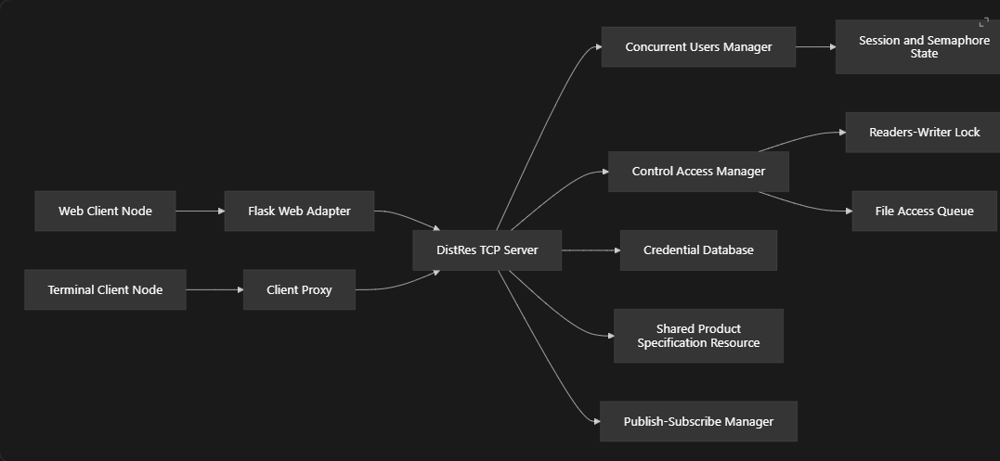
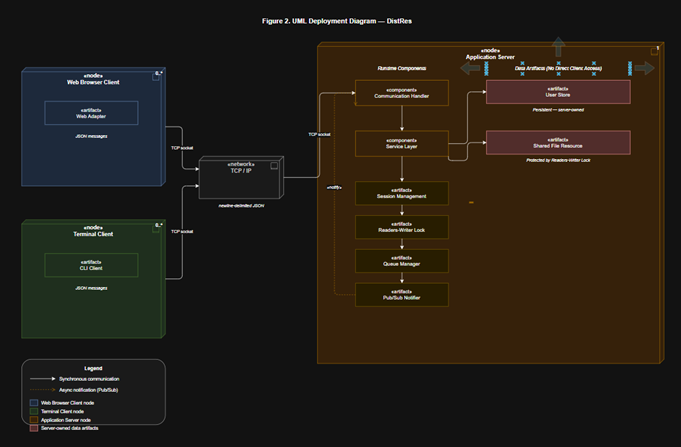
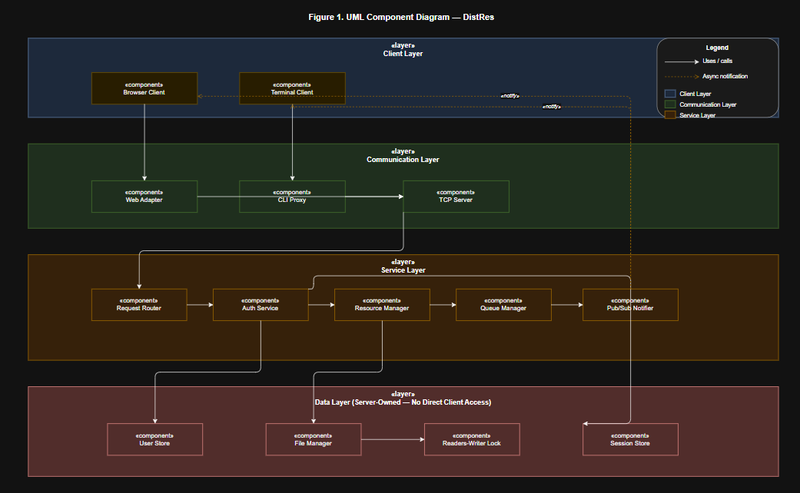

# DistRes: Distributed Resource Access and Synchronisation Engine

DistRes is the distributed version of the original ConRes concurrency project.

ConRes was a local Flask-based system where users could log in, wait for access, and safely read or edit a shared `ProductSpecification.txt` file. DistRes keeps the same idea, but moves the important coordination into a TCP client-server system.

In DistRes, the server owns the shared resources. Clients do not directly access the database, file, locks, queues, or sessions. Instead, browser clients and terminal clients send structured JSON messages to the DistRes TCP server.

## Project Integration

The previous Flask web pages are still used, but Flask is now a web client adapter rather than the main authority.

```text
Browser Client
  -> Flask Web Adapter
  -> DistRes TCP Server
  -> Server-owned resources
```

The terminal client also connects to the same TCP server:

```text
Terminal Client
  -> Client Proxy
  -> DistRes TCP Server
```

This means both the web interface and terminal client use the same distributed server logic.

## Architecture Images







## Main Features

- TCP client-server communication using Python sockets.
- JSON newline-delimited message protocol.
- Multiple distributed client nodes.
- Flask web interface integrated as a TCP client.
- Terminal client integrated as a TCP client.
- Server-side SQLite credential checking.
- Server-side session and semaphore management.
- Active and waiting user control.
- Concurrent read access to the shared file.
- Exclusive write access for one writer at a time.
- Fair file access queue for waiting writers.
- Publish-subscribe update notifications after writes.
- Cleanup on logout or unexpected client disconnect.
